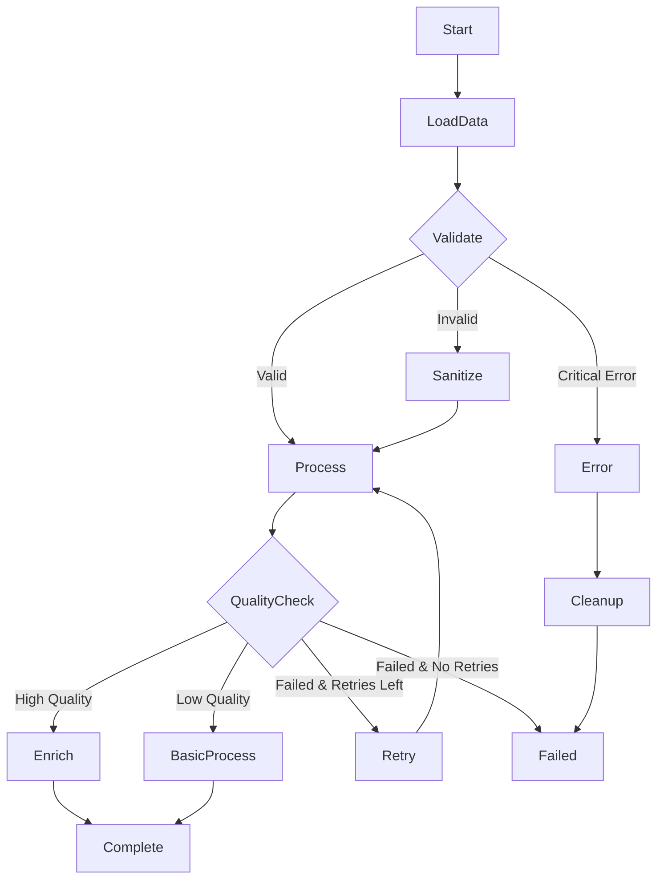

# 🚀 Cano: Async Data & AI Workflows in Rust

[](https://crates.io/crates/cano)
[](https://docs.rs/cano)
[](https://crates.io/crates/cano)
[](https://github.com/nassor/cano/blob/main/LICENSE)
[](https://github.com/nassor/cano/actions)

**Async workflow engine with built-in scheduling, retry logic, and state machine semantics.**

Cano is an async workflow engine for Rust that manages complex processing through composable workflows. It can be used for data processing, AI inference workflows, and background jobs. Cano provides a simple, fast and type-safe API for defining workflows with retry strategies, scheduling capabilities, and shared state management.

The engine is built on three core concepts: **Nodes** to encapsulate business logic, **Workflows** to manage state transitions, and **Schedulers** to run workflows on a schedule.

Only **Nodes** are required to implement your processing logic, while workflows and schedulers are optional and can be used as needed.

*The Node API is inspired by the [PocketFlow](https://github.com/The-Pocket/PocketFlow) project, adapted for Rust's async ecosystem.*

## Getting Started

Add Cano to your `Cargo.toml`:

```toml
[dependencies]
cano = "0.2"
async-trait = "0.1"
tokio = { version = "1.0", features = ["full"] }
```

### Basic Example

```rust
use async_trait::async_trait;
use cano::prelude::*;

// Define your workflow states
#[derive(Debug, Clone, PartialEq, Eq, Hash)]
enum WorkflowState {
    Start,
    Process,
    Complete,
}

struct ProcessorNode;

#[async_trait]
impl Node<WorkflowState> for ProcessorNode {
    type PrepResult = String;
    type ExecResult = bool;

    async fn prep(&self, store: &MemoryStore) -> Result<Self::PrepResult, CanoError> {
        let input: String = store.get("input").unwrap_or_default();
        Ok(input)
    }

    async fn exec(&self, prep_res: Self::PrepResult) -> Self::ExecResult {
        println!("Processing: {prep_res}");
        true // Success
    }

    async fn post(&self, store: &MemoryStore, exec_res: Self::ExecResult) 
        -> Result<WorkflowState, CanoError> {
        if exec_res {
            store.put("result", "processed".to_string())?;
            Ok(WorkflowState::Complete)
        } else {
            Ok(WorkflowState::Start) // Retry
        }
    }
}

#[tokio::main]
async fn main() -> Result<(), CanoError> {
    // Create a 2-step workflow
    let mut workflow = Workflow::new(WorkflowState::Start);
    workflow.register_node(WorkflowState::Start, ProcessorNode)
        .add_exit_state(WorkflowState::Complete);
    
    // Create store for sharing data between steps
    let store = MemoryStore::new();
    store.put("input", "Hello Cano!".to_string())?;
    
    // Run your workflow
    let result = workflow.orchestrate(&store).await?;
    println!("Workflow completed: {result:?}");
    
    Ok(())
}
```

This example demonstrates a basic workflow with a single processing node.

## Features

- **Node-based API**: Single `Node` trait for implementing processing logic
- **Fluent configuration**: Builder pattern for setup  
- **Retry strategies**: None, fixed delays, and exponential backoff with jitter
- **Shared state**: Thread-safe key-value store for data passing between nodes
- **Scheduling**: Built-in scheduler for intervals, cron schedules, and manual triggers
- **State machines**: Chain nodes together into complex workflows
- **Type safety**: Encourages Enum-driven state transitions with compile-time checking.
- **Performance**: Minimal overhead with direct execution

## How It Works

Cano is built around three concepts:

### 1. Nodes - Processing Units

A `Node` implements the processing logic for your workflow. Each node can perform preparation, execution, and post-processing steps, where the preparation step loads data from a shared store, execution performs the main logic, and post-processing updates the store and determines the next state.

```rust
// Node with specific processing logic
struct EmailProcessor;

#[async_trait]
impl Node<String> for EmailProcessor {
    type PrepResult = String;
    type ExecResult = bool;

    async fn prep(&self, store: &MemoryStore) -> Result<Self::PrepResult, CanoError> {
        // Load email data from store
        let email: String = store.get("email").unwrap_or_default();
        Ok(email)
    }

    async fn exec(&self, email: Self::PrepResult) -> Self::ExecResult {
        // Process the email
        println!("Sending email to: {email}");
        true // Success
    }

    async fn post(&self, store: &MemoryStore, success: Self::ExecResult) 
        -> Result<String, CanoError> {
        // Store the result and return next action
        if success {
            store.put("result", "sent".to_string())?;
            Ok("complete".to_string())
        } else {
            Ok("retry".to_string())
        }
    }
}
```

#### Retry Logic

Each node can be configured with retry logic using different strategies:

**No Retries** - Fail immediately:

```rust
impl Node<WorkflowState> for CriticalNode {
    fn config(&self) -> NodeConfig {
        NodeConfig::minimal()  // No retries, fail immediately
    }
    // ... rest of implementation
}
```

**Fixed Retries** - Consistent delays:

```rust
impl Node<WorkflowState> for ReliableNode {
    fn config(&self) -> NodeConfig {
        NodeConfig::new().with_fixed_retry(3, Duration::from_secs(2))
        // 3 retries with 2 second delays
    }
    // ... rest of implementation
}
```

**Exponential Backoff** - Increasing delays:

```rust
impl Node<WorkflowState> for ResilientNode {
    fn config(&self) -> NodeConfig {
        NodeConfig::new().with_exponential_retry(5)
        // 5 retries with exponential backoff (100ms, 200ms, 400ms, 800ms, 1.6s)
    }
    // ... rest of implementation
}
```

**Custom Exponential Backoff** - Fine-tuned retry behavior:

```rust
impl Node<WorkflowState> for CustomNode {
    fn config(&self) -> NodeConfig {
        NodeConfig::new().with_retry(
            RetryMode::exponential_custom(
                3,                              // max retries
                Duration::from_millis(50),      // base delay
                3.0,                            // multiplier  
                Duration::from_secs(10),        // max delay cap
                0.2,                            // 20% jitter
            )
        )
    }
    // ... rest of implementation
}
```

**When to Use Different Retry Modes:**

- **None**: Database transactions, critical validations
- **Fixed**: Network calls, file operations  
- **Exponential**: API calls, external services
- **Custom Exponential**: High-load scenarios requiring precise timing control

### 2. Store - Data Sharing

Cano allows **any type** to be used as a store for sharing data between workflow nodes. While MemoryStore is provided as a convenient key-value store implementation, you can use custom struct types for type-safe, performance-optimized data sharing.

#### Using MemoryStore (Key-Value Store)

The built-in MemoryStore provides a flexible key-value interface:

```rust
let store = MemoryStore::new();

// Store different types of data
store.put("user_id", 123)?;
store.put("name", "Alice".to_string())?;
store.put("scores", vec![85, 92, 78])?;
store.put("is_active", true)?;

// Retrieve data with type safety
let user_id: i32 = store.get("user_id")?;
let name: String = store.get("name")?;
let scores: Vec<i32> = store.get("scores")?;
let is_active: bool = store.get("is_active")?;

// Append items to existing collections
store.append("scores", 95)?;  // scores is now [85, 92, 78, 95]
store.append("tags", "important".to_string())?;  // Creates new Vec if key doesn't exist

// Remove individual items
store.remove("user_id")?;

// Check store status
let count = store.len()?;           // Get number of items
let is_empty = store.is_empty()?;   // Check if store is empty

// Iterate over all keys
let all_keys: Vec<String> = store.keys()?.collect();
for key in all_keys {
    println!("Found key: {}", key);
}

// Clear all data
store.clear()?;

// Alternative removal method
store.delete("name")?;  // Alias for remove()
```

#### Using Custom Store Types

For better performance and type safety, you can use any custom struct as a store. This enables direct field access, stack allocation, and compile-time type checking:

```rust
// Custom store with direct field access
#[derive(Debug, Clone, Default)]
struct RequestCtx {
    pub request_id: String,
    pub revenue: f64,
    pub customer_id: String,
    pub transaction_count: i32,
}

// Nodes can access and modify the custom store directly
#[async_trait]
impl Node<ProcessingState, RequestCtx> for MetricsNode {
    async fn prep(&self, store: &RequestCtx) -> Result<String, CanoError> {
        // Direct field access - no hash map lookups
        Ok(store.request_body.clone())
    }

    async fn post(&self, store: &RequestCtx, metrics: ProcessingResult) 
        -> Result<ProcessingState, CanoError> {
        // Nodes can read/modify store fields directly
        println!("Processing request: {} with revenue: {}", 
                 store.request_id, store.revenue);
        Ok(ProcessingState::Complete)
    }
}
```

**Custom stores provide:**

- **Performance**: Direct field access, no hash map overhead
- **Type Safety**: Compile-time guarantees about data structure  
- **Memory Efficiency**: Stack allocation, no heap allocations (if you are careful enough)
- **API Clarity**: Explicit data contracts between nodes

See the [`workflow_stack_store.rs`](./examples/workflow_stack_store.rs) example for a complete demonstration of custom store types with request processing pipelines.

### 3. Workflows - State Management

Build workflows with state machine semantics:

```rust
#[derive(Debug, Clone, PartialEq, Eq, Hash)]
enum WorkflowState {
    Validate,
    Process,
    SendEmail,
    Complete,
    Error,
}

let mut workflow = Workflow::new(WorkflowState::Validate);
workflow.register_node(WorkflowState::Validate, validator)
    .register_node(WorkflowState::Process, processor)
    .register_node(WorkflowState::SendEmail, email_sender)
    .add_exit_states(vec![WorkflowState::Complete, WorkflowState::Error]);

let result = workflow.orchestrate(&store).await?;
```

#### Complex Workflows

Build state machine pipelines with conditional branching, error handling, and retry logic:



```rust
#[derive(Debug, Clone, PartialEq, Eq, Hash)]
enum OrderState {
    Start,
    LoadData,
    Validate,
    Sanitize,
    Process,
    QualityCheck,
    Enrich,
    BasicProcess,
    Retry,
    Cleanup,
    Complete,
    Failed,
    Error,
}

// Validation node with multiple possible outcomes
struct ValidationNode;

#[async_trait]
impl Node<OrderState> for ValidationNode {
    type PrepResult = String;
    type ExecResult = ValidationResult;

    async fn prep(&self, store: &MemoryStore) -> Result<Self::PrepResult, CanoError> {
        let data: String = store.get("raw_data")?;
        Ok(data)
    }

    async fn exec(&self, data: Self::PrepResult) -> Self::ExecResult {
        if data.contains("critical_error") {
            ValidationResult::CriticalError
        } else if data.len() < 10 {
            ValidationResult::Invalid
        } else {
            ValidationResult::Valid
        }
    }

    async fn post(&self, store: &MemoryStore, result: Self::ExecResult) 
        -> Result<OrderState, CanoError> {
        match result {
            ValidationResult::Valid => {
                store.put("validation_status", "passed")?;
                Ok(OrderState::Process)
            }
            ValidationResult::Invalid => {
                store.put("validation_status", "needs_sanitization")?;
                Ok(OrderState::Sanitize)
            }
            ValidationResult::CriticalError => {
                store.put("error_reason", "critical_validation_failure")?;
                Ok(OrderState::Error)
            }
        }
    }
}

// Quality check node with conditional processing paths
struct QualityCheckNode;

#[async_trait]
impl Node<OrderState> for QualityCheckNode {
    type PrepResult = (String, i32);
    type ExecResult = QualityScore;

    async fn prep(&self, store: &MemoryStore) -> Result<Self::PrepResult, CanoError> {
        let data: String = store.get("processed_data")?;
        let attempt: i32 = store.get("retry_count").unwrap_or(0);
        Ok((data, attempt))
    }

    async fn exec(&self, (data, attempt): Self::PrepResult) -> Self::ExecResult {
        let score = calculate_quality_score(&data);
        QualityScore { score, attempt }
    }

    async fn post(&self, store: &MemoryStore, result: Self::ExecResult) 
        -> Result<OrderState, CanoError> {
        store.put("quality_score", result.score)?;
        
        match result.score {
            90..=100 => Ok(OrderState::Enrich),
            60..=89 => Ok(OrderState::BasicProcess),
            _ if result.attempt < 3 => {
                store.put("retry_count", result.attempt + 1)?;
                Ok(OrderState::Retry)
            }
            _ => Ok(OrderState::Failed),
        }
    }
}

// # ALL OTHER NODES...

// Build the complex workflow
let mut workflow = Workflow::new(OrderState::Start);
workflow
    .register_node(OrderState::Start, DataLoaderNode)
    .register_node(OrderState::LoadData, ValidationNode)
    .register_node(OrderState::Validate, SanitizeNode)
    .register_node(OrderState::Sanitize, ProcessNode)  
    .register_node(OrderState::Process, QualityCheckNode)
    .register_node(OrderState::QualityCheck, EnrichNode)
    .register_node(OrderState::Enrich, CompleteNode)     // -> Complete
    .register_node(OrderState::BasicProcess, CompleteNode) // -> Complete
    .register_node(OrderState::Retry, ProcessNode)        // -> Process
    .register_node(OrderState::Error, CleanupNode)        // -> Failed
    .add_exit_states(vec![
        OrderState::Complete, 
        OrderState::Failed
    ]);

let result = workflow.orchestrate(&store).await?;
```

## Scheduler - Workflow Scheduling

The Scheduler provides workflow scheduling capabilities for background jobs, periodic processing, and automated workflows.

### Scheduler Usage

```rust
use cano::prelude::*;
use tokio::time::Duration;

#[tokio::main]
async fn main() -> CanoResult<()> {
    let mut scheduler: Scheduler<MyState, MemoryStore> = Scheduler::new();
    
    let workflow = Workflow::new(MyState::Start);
    
    // Multiple scheduling options:
    scheduler.every_seconds("task1", workflow.clone(), 30)?;                    // Every 30 seconds
    scheduler.every_minutes("task2", workflow.clone(), 5)?;                     // Every 5 minutes  
    scheduler.every_hours("task3", workflow.clone(), 2)?;                       // Every 2 hours
    scheduler.every("task4", workflow.clone(), Duration::from_millis(500))?;    // Every 500ms
    scheduler.cron("task5", workflow.clone(), "0 */10 * * * *")?;              // Every 10 minutes (cron)
    scheduler.manual("task6", workflow)?;                                       // Manual trigger only
    
    // Start the scheduler
    scheduler.start().await?;
    
    // Trigger a manual workflow
    scheduler.trigger("task6").await?;
    
    // Check workflow status
    if let Some(status) = scheduler.status("task1").await {
        println!("Task1 status: {:?}", status);
    }
    
    // Graceful shutdown with timeout
    scheduler.stop().await?;
    
    Ok(())
}
```

### Scheduler Features

- **Flexible Scheduling**: Support for intervals, cron expressions, and manual triggers
- **Convenience Methods**: `every_seconds()`, `every_minutes()`, `every_hours()` helpers
- **Status Monitoring**: Check workflow status, run counts, and execution times
- **Manual Control**: Trigger flows manually and monitor execution
- **Graceful Shutdown**: Stop with timeout for running flows to complete
- **Concurrent Execution**: Multiple flows can run simultaneously

### Advanced Scheduler Usage

```rust
// Scheduled workflow examples
let mut scheduler = Scheduler::new();

// Data processing every hour
scheduler.every_hours("data_sync", data_processing_flow, 1)?;

// Health checks every 30 seconds  
scheduler.every_seconds("health_check", monitoring_flow, 30)?;

// Daily reports at 9 AM using cron
scheduler.cron("daily_report", reporting_flow, "0 0 9 * * *")?;

// Manual cleanup task
scheduler.manual("cleanup", cleanup_flow)?;

// Start the scheduler
scheduler.start().await?;

// Monitor running flows
tokio::spawn(async move {
    loop {
        let running_count = scheduler.running_count().await;
        println!("Currently running flows: {}", running_count);
        
        // List all workflow statuses
        let flows = scheduler.list().await;
        for flow_info in flows {
            println!("Workflow {}: {:?} (runs: {})", 
                flow_info.id, flow_info.status, flow_info.run_count);
        }
        
        tokio::time::sleep(Duration::from_secs(10)).await;
    }
});

// Graceful shutdown with 30 second timeout
scheduler.stop_with_timeout(Duration::from_secs(30)).await?;
```

## Testing & Benchmarks

Run tests and view performance metrics:

```bash
# Run all tests
cargo test

# Run performance benchmarks  
cargo bench --bench store_performance
cargo bench --bench flow_performance
cargo bench --bench node_performance

# Run AI workflow examples
cargo run --example ai_workflow_yes_and

# Run workflow examples
cargo run --example workflow_simple
cargo run --example workflow_book_prepositions
cargo run --example workflow_negotiation
cargo run --example workflow_stack_store

# Run scheduler scheduling examples
cargo run --example scheduler_scheduling
cargo run --example scheduler_duration_scheduling
cargo run --example scheduler_concurrent_workflows
cargo run --example scheduler_graceful_shutdown

Benchmark results are saved in `target/criterion/`.
```

## Documentation

- **[API Documentation](https://docs.rs/cano)** - Complete API reference
- **[Examples Directory](./examples/)** - Hands-on code examples
- **[Benchmarks](./benches/)** - Performance testing and optimization

## Contributing

Contributions are welcome in the following areas:

- **Documentation** - Improve guides and examples
- **Features** - Add new store backends or workflow capabilities  
- **Performance** - Optimize performance and memory usage
- **Testing** - Add test cases and edge case coverage
- **Bug Fixes** - Report and fix issues

## License

This project is licensed under the MIT License - see the [LICENSE](LICENSE) file for details.
