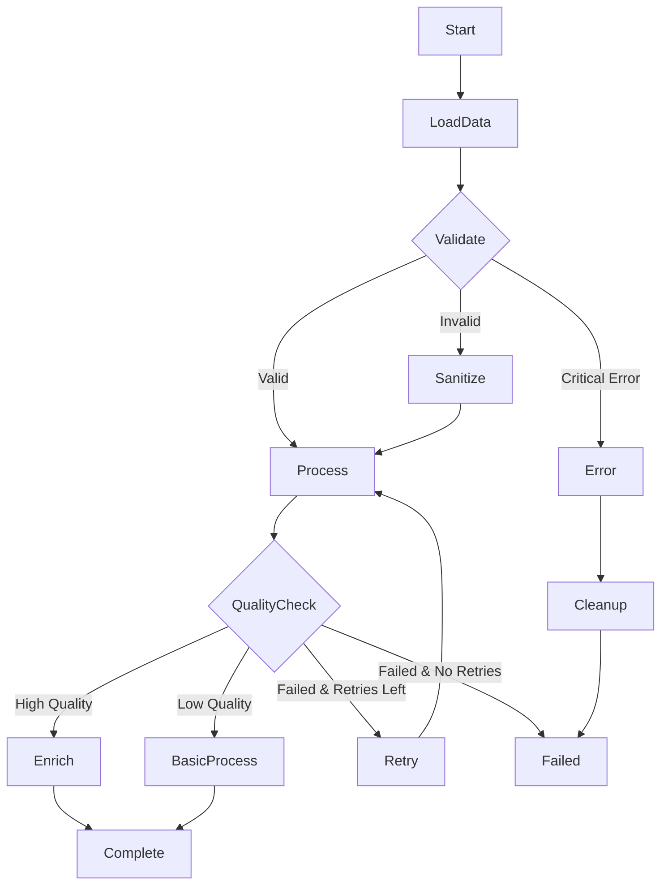

# Cano: Async Data & AI Workflows in Rust

[](https://crates.io/crates/cano)
[](https://docs.rs/cano)
[](https://crates.io/crates/cano)
[](https://github.com/nassor/cano/blob/main/LICENSE)
[](https://github.com/nassor/cano/actions)

**Async workflow engine with built-in scheduling, retry logic, and state machine semantics.**

Cano is an async workflow engine for Rust that manages complex processing through composable workflows. It can be used for data processing, AI inference workflows, and background jobs. Cano provides a simple, fast and type-safe API for defining workflows with retry strategies, concurrent execution, scheduling capabilities, and shared state management.

The engine is built on three core concepts: **Nodes** to encapsulate business logic, **Workflows** to manage state transitions, and **Schedulers** to run workflows on a schedule. For high-throughput scenarios, **Concurrent Workflows** enable parallel execution of multiple workflow instances.

Only **Nodes** are required to implement your processing logic, while workflows and schedulers are optional and can be used as needed.

*The Node API is inspired by the [PocketFlow](https://github.com/The-Pocket/PocketFlow) project, adapted for Rust's async ecosystem.*

## 🚀 Getting Started

Add Cano to your `Cargo.toml`:

```toml
[dependencies]
cano = "0.3"
async-trait = "0.1"
tokio = { version = "1.0", features = ["full"] }
```

### Basic Example

```rust
use async_trait::async_trait;
use cano::prelude::*;

// Define your workflow states
#[derive(Debug, Clone, PartialEq, Eq, Hash)]
enum WorkflowState {
    Start,
    Process,
    Complete,
}

struct ProcessorNode;

#[async_trait]
impl Node<WorkflowState> for ProcessorNode {
    type PrepResult = String;
    type ExecResult = bool;

    async fn prep(&self, store: &MemoryStore) -> Result<Self::PrepResult, CanoError> {
        let input: String = store.get("input").unwrap_or_default();
        Ok(input)
    }

    async fn exec(&self, prep_res: Self::PrepResult) -> Self::ExecResult {
        println!("Processing: {prep_res}");
        true // Success
    }

    async fn post(&self, store: &MemoryStore, exec_res: Self::ExecResult) 
        -> Result<WorkflowState, CanoError> {
        if exec_res {
            store.put("result", "processed".to_string())?;
            Ok(WorkflowState::Complete)
        } else {
            Ok(WorkflowState::Start) // Retry
        }
    }
}

#[tokio::main]
async fn main() -> Result<(), CanoError> {
    // Create a 2-step workflow
    let mut workflow = Workflow::new(WorkflowState::Start);
    workflow.register_node(WorkflowState::Start, ProcessorNode)
        .add_exit_state(WorkflowState::Complete);
    
    // Create store for sharing data between steps
    let store = MemoryStore::new();
    store.put("input", "Hello Cano!".to_string())?;
    
    // Run your workflow
    let result = workflow.orchestrate(&store).await?;
    println!("Workflow completed: {result:?}");
    
    Ok(())
}
```

This example demonstrates a basic workflow with a single processing node.

## ✨ Features

- **Node-based API**: Single `Node` trait for implementing processing logic
- **Retry strategies**: None, fixed delays, and exponential backoff with jitter
- **Shared state**: Thread-safe key-value store for data passing between nodes
- **Sequential workflows**: Define workflows with state transitions and exit states, allowing complex branching logic
- **Concurrent workflows**: Execute multiple workflows in parallel for I/O-bound operations
- **Scheduling**: Built-in scheduler for intervals, cron schedules, manual triggers, and concurrent workflows
- **State machines**: Chain nodes together into complex workflows
- **Type safety**: Encourages Enum-driven state transitions with compile-time checking
- **🚀 Performance**: Minimal overhead with direct execution

## 🏗️ Core Concepts

### 🔧 Nodes - Processing Units

A `Node` implements the processing logic for your workflow with three phases: preparation (load data), execution (main logic), and post-processing (update state):

```rust
struct EmailProcessor;

#[async_trait]
impl Node<String> for EmailProcessor {
    type PrepResult = String;
    type ExecResult = bool;

    async fn prep(&self, store: &MemoryStore) -> Result<Self::PrepResult, CanoError> {
        let email: String = store.get("email").unwrap_or_default();
        Ok(email)
    }

    async fn exec(&self, email: Self::PrepResult) -> Self::ExecResult {
        println!("Sending email to: {email}");
        true // Success
    }

    async fn post(&self, store: &MemoryStore, success: Self::ExecResult) 
        -> Result<String, CanoError> {
        if success {
            store.put("result", "sent".to_string())?;
            Ok("complete".to_string())
        } else {
            Ok("retry".to_string())
        }
    }
}
```

#### 🔄 Retry Strategies

Configure retry behavior based on your needs:

```rust
impl Node<WorkflowState> for MyNode {
    fn config(&self) -> NodeConfig {
        // No retries - fail immediately
        NodeConfig::minimal()
        
        // Fixed retries - consistent delays
        NodeConfig::new().with_fixed_retry(3, Duration::from_secs(2))
        
        // Exponential backoff - increasing delays (100ms, 200ms, 400ms...)
        NodeConfig::new().with_exponential_retry(5)
        
        // Custom exponential with jitter
        NodeConfig::new().with_retry(
            RetryMode::exponential_custom(3, Duration::from_millis(50), 2.0, Some(0.1))
        )
    }
}
```

**When to use:** None (DB transactions), Fixed (network calls), Exponential (APIs), Custom (high-load scenarios).

### 🗃️ Store - Data Sharing

Choose between **MemoryStore** (flexible key-value) or **custom structs** (type-safe, performant):

```rust
// MemoryStore - flexible key-value storage
let store = MemoryStore::new();
store.put("user_id", 123)?;
store.put("scores", vec![85, 92, 78])?;
store.append("scores", 95)?;  // [85, 92, 78, 95]
let user_id: i32 = store.get("user_id")?;

// Custom store - direct field access, better performance
#[derive(Debug, Clone, Default)]
struct RequestCtx {
    pub request_id: String,
    pub revenue: f64,
    pub customer_id: String,
}

#[async_trait]
impl Node<ProcessingState, RequestCtx> for MetricsNode {
    async fn prep(&self, store: &RequestCtx) -> Result<String, CanoError> {
        Ok(store.request_id.clone())  // Direct field access
    }
    
    async fn post(&self, store: &RequestCtx, result: ProcessingResult) 
        -> Result<ProcessingState, CanoError> {
        println!("Revenue: {}", store.revenue);  // Type-safe access
        Ok(ProcessingState::Complete)
    }
}
```

### 🔗 Workflows - State Management

Build workflows with state machine semantics and conditional branching:

```rust
#[derive(Debug, Clone, PartialEq, Eq, Hash)]
enum OrderState {
    Start, Validate, Process, Complete, Failed
}

// Simple workflow
let mut workflow = Workflow::new(OrderState::Start);
workflow.register_node(OrderState::Start, ValidatorNode)
    .register_node(OrderState::Validate, ProcessorNode)
    .add_exit_states(vec![OrderState::Complete, OrderState::Failed]);

// Complex branching with conditional logic
struct ValidationNode;

#[async_trait]
impl Node<OrderState> for ValidationNode {
    type PrepResult = String;
    type ExecResult = ValidationResult;

    async fn post(&self, store: &MemoryStore, result: Self::ExecResult) 
        -> Result<OrderState, CanoError> {
        match result {
            ValidationResult::Valid => Ok(OrderState::Process),
            ValidationResult::Invalid => Ok(OrderState::Failed),
            ValidationResult::Retry => Ok(OrderState::Start),
        }
    }
}

let result = workflow.orchestrate(&store).await?;
```

#### Complex Workflow Example

For more sophisticated processing pipelines with conditional branching, error handling, and retry logic:



```rust
#[derive(Debug, Clone, PartialEq, Eq, Hash)]
enum OrderState {
    Start, LoadData, Validate, Sanitize, Process, QualityCheck,
    Enrich, BasicProcess, Retry, Cleanup, Complete, Failed, Error,
}

// Validation node with multiple possible outcomes
struct ValidationNode;

#[async_trait]
impl Node<OrderState> for ValidationNode {
    type PrepResult = String;
    type ExecResult = ValidationResult;

    async fn prep(&self, store: &MemoryStore) -> Result<Self::PrepResult, CanoError> {
        let data: String = store.get("raw_data")?;
        Ok(data)
    }

    async fn exec(&self, data: Self::PrepResult) -> Self::ExecResult {
        if data.contains("critical_error") {
            ValidationResult::CriticalError
        } else if data.len() < 10 {
            ValidationResult::Invalid
        } else {
            ValidationResult::Valid
        }
    }

    async fn post(&self, store: &MemoryStore, result: Self::ExecResult) 
        -> Result<OrderState, CanoError> {
        match result {
            ValidationResult::Valid => {
                store.put("validation_status", "passed")?;
                Ok(OrderState::Process)
            }
            ValidationResult::Invalid => {
                store.put("validation_status", "needs_sanitization")?;
                Ok(OrderState::Sanitize)
            }
            ValidationResult::CriticalError => {
                store.put("error_reason", "critical_validation_failure")?;
                Ok(OrderState::Error)
            }
        }
    }
}

// Quality check node with conditional processing paths
struct QualityCheckNode;

#[async_trait]
impl Node<OrderState> for QualityCheckNode {
    type PrepResult = (String, i32);
    type ExecResult = QualityScore;

    async fn prep(&self, store: &MemoryStore) -> Result<Self::PrepResult, CanoError> {
        let data: String = store.get("processed_data")?;
        let attempt: i32 = store.get("retry_count").unwrap_or(0);
        Ok((data, attempt))
    }

    async fn exec(&self, (data, attempt): Self::PrepResult) -> Self::ExecResult {
        let score = calculate_quality_score(&data);
        QualityScore { score, attempt }
    }

    async fn post(&self, store: &MemoryStore, result: Self::ExecResult) 
        -> Result<OrderState, CanoError> {
        store.put("quality_score", result.score)?;
        
        match result.score {
            90..=100 => Ok(OrderState::Enrich),
            60..=89 => Ok(OrderState::BasicProcess),
            _ if result.attempt < 3 => {
                store.put("retry_count", result.attempt + 1)?;
                Ok(OrderState::Retry)
            }
            _ => Ok(OrderState::Failed),
        }
    }
}

// ALL OTHER NODES...

// Build the complex workflow
let mut workflow = Workflow::new(OrderState::Start);
workflow
    .register_node(OrderState::Start, DataLoaderNode)
    .register_node(OrderState::LoadData, ValidationNode)
    .register_node(OrderState::Validate, SanitizeNode)
    .register_node(OrderState::Sanitize, ProcessNode)  
    .register_node(OrderState::Process, QualityCheckNode)
    .register_node(OrderState::QualityCheck, EnrichNode)
    .register_node(OrderState::Enrich, CompleteNode)
    .register_node(OrderState::BasicProcess, CompleteNode)
    .register_node(OrderState::Retry, ProcessNode)        // Retry goes back to Process
    .register_node(OrderState::Error, CleanupNode)        // Error handling
    .add_exit_states(vec![OrderState::Complete, OrderState::Failed]);

let result = workflow.orchestrate(&store).await?;
```

## ⚡ Concurrent Workflows

Execute multiple workflows in parallel for I/O-bound operations and batch processing with dramatic performance improvements.

### 🎯 When to Use

**✅ Ideal for:** I/O operations, batch processing, API calls, independent workflows  
**❌ Avoid for:** CPU-intensive tasks, sequential dependencies, shared resource contention

**Performance:** 5x-47x speedup for I/O-bound operations (5 workflows: 18ms vs 92ms sequential)

### 📋 Usage & Strategies

```rust
use cano::prelude::*;

#[tokio::main]
async fn main() -> CanoResult<()> {
    // Create workflow instances
    let workflow_instances = vec![
        ConcurrentWorkflowInstance::new("batch_1", processing_workflow()),
        ConcurrentWorkflowInstance::new("batch_2", processing_workflow()),
        ConcurrentWorkflowInstance::new("batch_3", processing_workflow()),
    ];
    
    // Choose strategy based on requirements
    let strategies = vec![
        ConcurrentStrategy::WaitForever,                          // Wait for all
        ConcurrentStrategy::WaitForQuota(2),                      // Wait for 2 to complete
        ConcurrentStrategy::WaitDuration(Duration::from_secs(30)), // 30-second timeout
    ];
    
    let mut concurrent_workflow = ConcurrentWorkflow::new(strategies[0]);
    concurrent_workflow.add_instances(workflow_instances);
    
    let results = concurrent_workflow.orchestrate(store).await?;
    println!("✅ Completed: {}, ❌ Failed: {}, ⏱️ Duration: {:?}", 
             results.completed, results.failed, results.duration);
    
    Ok(())
}
```

## ⏰ Scheduler

Schedule workflows for background jobs, periodic processing, and automated workflows with multiple trigger options.

### 📋 Basic Usage

```rust
use cano::prelude::*;

#[tokio::main]
async fn main() -> CanoResult<()> {
    let mut scheduler: Scheduler<MyState, MemoryStore> = Scheduler::new();
    let workflow = Workflow::new(MyState::Start);
    
    // Multiple scheduling options
    scheduler.every_seconds("health_check", workflow.clone(), 30)?;           // Every 30s
    scheduler.every_minutes("data_sync", workflow.clone(), 5)?;               // Every 5min
    scheduler.every_hours("reports", workflow.clone(), 2)?;                   // Every 2h
    scheduler.cron("daily_cleanup", workflow.clone(), "0 0 2 * * *")?;       // Daily 2 AM
    scheduler.manual("emergency_task", workflow)?;                            // Manual only
    
    scheduler.start().await?;
    
    // Manual trigger and monitoring
    scheduler.trigger("emergency_task").await?;
    if let Some(status) = scheduler.status("health_check").await {
        println!("Task status: {:?}", status);
    }
    
    scheduler.stop().await?;
    Ok(())
}
```

### 🔄 Scheduled Concurrent Workflows

Combine scheduling with parallel execution for high-throughput batch processing:

```rust
#[tokio::main]
async fn main() -> CanoResult<()> {
    let mut scheduler = Scheduler::new();
    
    // Create concurrent workflow for batch processing
    let mut batch_workflow = ConcurrentWorkflow::new(ConcurrentStrategy::WaitForQuota(8));
    let workflow_instances: Vec<_> = (1..=10)
        .map(|i| ConcurrentWorkflowInstance::new(format!("item_{}", i), processing_workflow()))
        .collect();
    batch_workflow.add_instances(workflow_instances);
    
    // Schedule concurrent workflows
    scheduler.every_seconds_concurrent("batch_process", batch_workflow, 30)?;    // Every 30s
    scheduler.cron_concurrent("daily_reports", reporting_workflow, "0 0 2 * * *")?; // Daily 2 AM
    scheduler.manual_concurrent("emergency_sync", emergency_workflow)?;          // Manual trigger
    
    scheduler.start().await?;
    
    // Monitor execution
    tokio::spawn(async move {
        loop {
            let flows = scheduler.list().await;
            for flow in flows {
                if flow.is_concurrent {
                    println!("Concurrent flow {}: {} completed, {} failed", 
                             flow.id, flow.completed_instances, flow.failed_instances);
                }
            }
            tokio::time::sleep(Duration::from_secs(30)).await;
        }
    });
    
    scheduler.stop().await?;
    Ok(())
}
```

## 🧪 Testing & Examples

```bash
# Run tests, examples, and benchmarks
cargo test

# Run examples
cargo run --example <example_name>

# Run benchmarks (view benchmark results in target/criterion/)
cargo bench --bench <benchmark_name>
```

## 📚 Documentation & Contributing

- **[API Documentation](https://docs.rs/cano)** - Complete API reference
- **[Examples Directory](./examples/)** - Hands-on code examples  
- **[Benchmarks](./benches/)** - Performance testing

**Contributing areas:** Documentation, features, performance optimization, testing, bug fixes.

## 📄 License

Licensed under the MIT License - see [LICENSE](LICENSE) for details.
