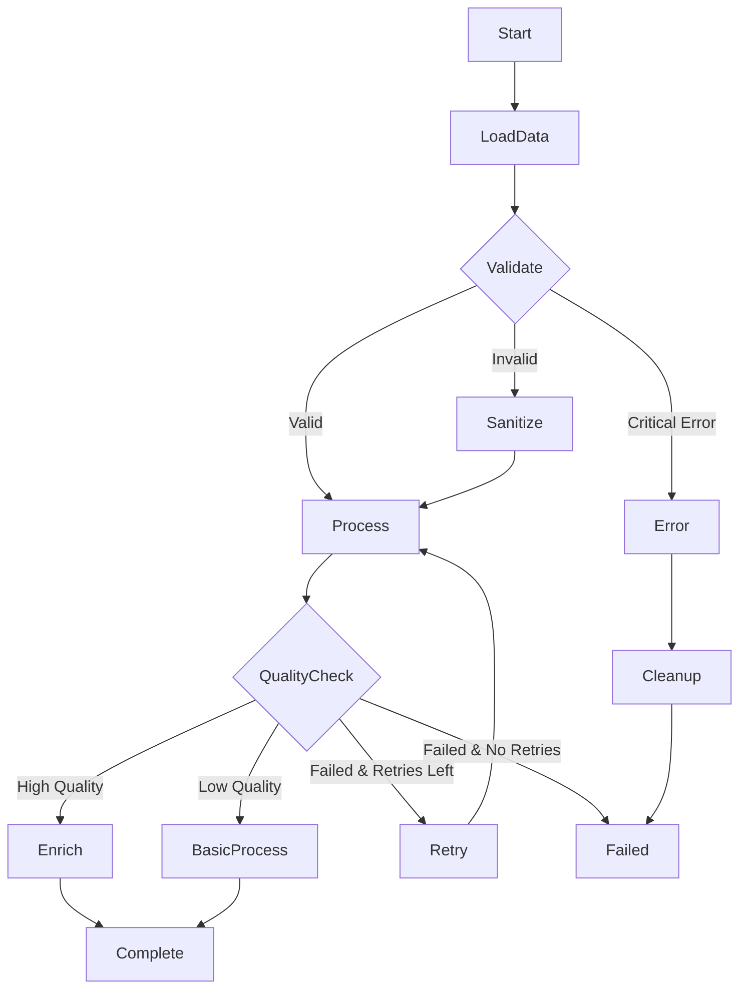

# Cano: Async Data & AI Workflows in Rust

[](https://crates.io/crates/cano)
[](https://docs.rs/cano)
[](https://crates.io/crates/cano)
[](https://github.com/nassor/cano/blob/main/LICENSE)
[](https://github.com/nassor/cano/actions)

**Async workflow engine with built-in scheduling, retry logic, and state machine semantics.**

Cano is an async workflow engine for Rust that manages complex processing through composable workflows. It can be used for data processing, AI inference workflows, and background jobs. Cano provides a simple, fast and type-safe API for defining workflows with retry strategies, scheduling capabilities, and shared state management.

The engine is built on three core concepts: **Nodes** to encapsulate business logic, **Workflows** to manage state transitions, and **Schedulers** to run workflows on a schedule.

*The Node API is inspired by the [PocketFlow](https://github.com/The-Pocket/PocketFlow) project, adapted for Rust's async ecosystem.*

## Features

- **Node-based API**: Single `Node` trait for implementing processing logic
- **State Machines**: Type-safe enum-driven state transitions with compile-time checking
- **Retry Strategies**: None, fixed delays, and exponential backoff with jitter
- **Flexible Storage**: Built-in `MemoryStore` or custom struct types for data sharing
- **Workflow Scheduling**: Built-in scheduler with intervals, cron schedules, and manual triggers
- **Concurrent Execution**: Execute multiple workflow instances in parallel with timeout strategies
- **Performance**: Minimal overhead with direct execution and zero-cost abstractions

## Getting Started

Add Cano to your `Cargo.toml`:

```toml
[dependencies]
cano = "0.3"
async-trait = "0.1"
tokio = { version = "1", features = ["full"] }
```

### Basic Example

```rust
use async_trait::async_trait;
use cano::prelude::*;

// Define your workflow states
#[derive(Debug, Clone, PartialEq, Eq, Hash)]
enum WorkflowState {
    Start,
    Complete,
}

struct ProcessorNode;

#[async_trait]
impl Node<WorkflowState> for ProcessorNode {
    type PrepResult = String;
    type ExecResult = bool;

    async fn prep(&self, store: &MemoryStore) -> Result<Self::PrepResult, CanoError> {
        let input: String = store.get("input").unwrap_or_default();
        Ok(input)
    }

    async fn exec(&self, prep_res: Self::PrepResult) -> Self::ExecResult {
        println!("Processing: {prep_res}");
        true // Success
    }

    async fn post(&self, store: &MemoryStore, exec_res: Self::ExecResult) 
        -> Result<WorkflowState, CanoError> {
        if exec_res {
            store.put("result", "processed".to_string())?;
            Ok(WorkflowState::Complete)
        } else {
            Ok(WorkflowState::Start) // Retry
        }
    }
}

#[tokio::main]
async fn main() -> Result<(), CanoError> {
    // Create workflow
    let mut workflow = Workflow::new(WorkflowState::Start);
    workflow.register_node(WorkflowState::Start, ProcessorNode)
        .add_exit_state(WorkflowState::Complete);
    
    // Create store and run workflow
    let store = MemoryStore::new();
    store.put("input", "Hello Cano!".to_string())?;
    
    let result = workflow.orchestrate(&store).await?;
    println!("Workflow completed: {result:?}");
    
    Ok(())
}
```

## Core Concepts

### 1. Nodes - Processing Units

A `Node` implements the processing logic for your workflow. Each node follows a three-phase lifecycle:
1. **Prep**: Load data, validate inputs, setup resources
2. **Exec**: Core processing logic (with automatic retry support)  
3. **Post**: Store results, cleanup, determine next action

```rust
struct EmailProcessor;

#[async_trait]
impl Node<String> for EmailProcessor {
    type PrepResult = String;
    type ExecResult = bool;

    async fn prep(&self, store: &MemoryStore) -> Result<Self::PrepResult, CanoError> {
        let email: String = store.get("email").unwrap_or_default();
        Ok(email)
    }

    async fn exec(&self, email: Self::PrepResult) -> Self::ExecResult {
        println!("Sending email to: {email}");
        true // Success
    }

    async fn post(&self, store: &MemoryStore, success: Self::ExecResult) 
        -> Result<String, CanoError> {
        if success {
            store.put("result", "sent".to_string())?;
            Ok("complete".to_string())
        } else {
            Ok("retry".to_string())
        }
    }
}
```

#### Retry Strategies

Configure retry behavior using `NodeConfig`:

```rust
impl Node<WorkflowState> for ReliableNode {
    fn config(&self) -> NodeConfig {
        // No retries (fail fast)
        NodeConfig::minimal()
        
        // Fixed retries: 3 attempts with 2 second delays
        // NodeConfig::new().with_fixed_retry(3, Duration::from_secs(2))
        
        // Exponential backoff: 5 retries with increasing delays
        // NodeConfig::new().with_exponential_retry(5)
    }
    // ... rest of implementation
}
```
### 2. Store - Data Sharing

Cano supports flexible data sharing between workflow nodes through stores.

#### MemoryStore (Key-Value Store)

The built-in MemoryStore provides a flexible key-value interface:

```rust
let store = MemoryStore::new();

// Store different types of data
store.put("user_id", 123)?;
store.put("name", "Alice".to_string())?;
store.put("scores", vec![85, 92, 78])?;

// Retrieve data with type safety
let user_id: i32 = store.get("user_id")?;
let name: String = store.get("name")?;

// Append items to existing collections
store.append("scores", 95)?;  // scores is now [85, 92, 78, 95]

// Store operations
let count = store.len()?;
let is_empty = store.is_empty()?;
store.clear()?;
```

#### Custom Store Types

For better performance and type safety, use custom struct types:

```rust
#[derive(Debug, Clone, Default)]
struct RequestCtx {
    pub request_id: String,
    pub transaction_count: i32,
}

#[async_trait]
impl Node<ProcessingState, RequestCtx> for MetricsNode {
    async fn prep(&self, store: &RequestCtx) -> Result<String, CanoError> {
        // Direct field access - no hash map overhead
        Ok(store.request_id.clone())
    }

    async fn post(&self, store: &RequestCtx, result: ProcessingResult) 
        -> Result<ProcessingState, CanoError> {
        println!("Processing request: {}", store.request_id);
        Ok(ProcessingState::Complete)
    }
}
```

### 3. Workflows - State Management

Build workflows with state machine semantics:

```rust
#[derive(Debug, Clone, PartialEq, Eq, Hash)]
enum WorkflowState {
    Validate,
    Process,
    Complete,
    Error,
}

let mut workflow = Workflow::new(WorkflowState::Validate);
workflow.register_node(WorkflowState::Validate, validator)
    .register_node(WorkflowState::Process, processor)
    .add_exit_states(vec![WorkflowState::Complete, WorkflowState::Error]);

let result = workflow.orchestrate(&store).await?;
```

#### Complex Workflows

Build sophisticated state machine pipelines with conditional branching and error handling:



```rust
#[derive(Debug, Clone, PartialEq, Eq, Hash)]
enum OrderState {
    Start,
    LoadData,
    Validate,
    Sanitize,
    Process,
    QualityCheck,
    Enrich,
    BasicProcess,
    Retry,
    Cleanup,
    Complete,
    Failed,
    Error,
}

// Validation node with multiple outcomes
struct ValidationNode;

#[async_trait]
impl Node<OrderState> for ValidationNode {
    type PrepResult = String;
    type ExecResult = ValidationResult;

    async fn prep(&self, store: &MemoryStore) -> Result<Self::PrepResult, CanoError> {
        let data: String = store.get("raw_data")?;
        Ok(data)
    }

    async fn exec(&self, data: Self::PrepResult) -> Self::ExecResult {
        if data.contains("critical_error") {
            ValidationResult::CriticalError
        } else if data.len() < 10 {
            ValidationResult::Invalid
        } else {
            ValidationResult::Valid
        }
    }

    async fn post(&self, store: &MemoryStore, result: Self::ExecResult) 
        -> Result<OrderState, CanoError> {
        match result {
            ValidationResult::Valid => Ok(OrderState::Process),
            ValidationResult::Invalid => Ok(OrderState::Sanitize),
            ValidationResult::CriticalError => Ok(OrderState::Error),
        }
    }
}

// Quality check node with retry logic
struct QualityCheckNode;

#[async_trait]
impl Node<OrderState> for QualityCheckNode {
    type PrepResult = (String, i32);
    type ExecResult = QualityScore;

    async fn prep(&self, store: &MemoryStore) -> Result<Self::PrepResult, CanoError> {
        let data: String = store.get("processed_data")?;
        let attempt: i32 = store.get("retry_count").unwrap_or(0);
        Ok((data, attempt))
    }

    async fn exec(&self, (data, attempt): Self::PrepResult) -> Self::ExecResult {
        let score = calculate_quality_score(&data);
        QualityScore { score, attempt }
    }

    async fn post(&self, store: &MemoryStore, result: Self::ExecResult) 
        -> Result<OrderState, CanoError> {
        store.put("quality_score", result.score)?;
        
        match result.score {
            90..=100 => Ok(OrderState::Enrich),
            60..=89 => Ok(OrderState::BasicProcess),
            _ if result.attempt < 3 => {
                store.put("retry_count", result.attempt + 1)?;
                Ok(OrderState::Retry)
            }
            _ => Ok(OrderState::Failed),
        }
    }
}

// OTHER NODES ...

// Build the complete workflow
let mut workflow = Workflow::new(OrderState::Start);
workflow
    .register_node(OrderState::Start, DataLoaderNode)
    .register_node(OrderState::Validate, ValidationNode)
    .register_node(OrderState::Sanitize, SanitizeNode)  
    .register_node(OrderState::Process, ProcessNode)
    .register_node(OrderState::QualityCheck, QualityCheckNode)
    .register_node(OrderState::Enrich, EnrichNode)
    .register_node(OrderState::BasicProcess, CompleteNode)
    .register_node(OrderState::Retry, ProcessNode)
    .register_node(OrderState::Error, CleanupNode)
    .add_exit_states(vec![OrderState::Complete, OrderState::Failed]);

let result = workflow.orchestrate(&store).await?;
```

### Concurrent Workflows

Execute multiple workflow instances in parallel with different timeout strategies:

```rust
use cano::prelude::*;

// Create a concurrent workflow
let concurrent_workflow = ConcurrentWorkflowBuilder::new()
    .with_workflow(base_workflow)
    .build();

// Execute with different wait strategies
let stores: Vec<MemoryStore> = (0..10).map(|_| MemoryStore::new()).collect();

// Wait for all workflows to complete
let results = concurrent_workflow
    .execute_concurrent(&stores, WaitStrategy::WaitForever)
    .await?;

// Wait for first 5 to complete, then cancel the rest
let results = concurrent_workflow
    .execute_concurrent(&stores, WaitStrategy::WaitForQuota(5))
    .await?;

// Execute within time limit
let results = concurrent_workflow
    .execute_concurrent(&stores, WaitStrategy::WaitDuration(Duration::from_secs(30)))
    .await?;
```
## Scheduling Workflows

The Scheduler provides workflow scheduling capabilities for background jobs and automated workflows:

```rust
use cano::prelude::*;
use tokio::time::Duration;

#[derive(Debug, Clone, PartialEq, Eq, Hash)]
enum MyState {
    Start,
    Complete,
}

#[derive(Clone)]
struct MyTask;

#[async_trait::async_trait]
impl Node<MyState> for MyTask {
    type PrepResult = ();
    type ExecResult = bool;

    async fn prep(&self, _store: &MemoryStore) -> Result<Self::PrepResult, CanoError> {
        Ok(())
    }

    async fn exec(&self, _prep_res: Self::PrepResult) -> Self::ExecResult {
        println!("Executing task...");
        true
    }

    async fn post(&self, _store: &MemoryStore, exec_res: Self::ExecResult) 
        -> Result<MyState, CanoError> {
        if exec_res {
            Ok(MyState::Complete)
        } else {
            Ok(MyState::Start)
        }
    }
}

#[tokio::main]
async fn main() -> CanoResult<()> {
    let mut scheduler: Scheduler<MyState> = Scheduler::new();
    
    // Create regular workflows
    let mut workflow1 = Workflow::new(MyState::Start);
    workflow1.add_exit_state(MyState::Complete);
    workflow1.register_node(MyState::Start, MyTask);

    let mut workflow2 = Workflow::new(MyState::Start);
    workflow2.add_exit_state(MyState::Complete);
    workflow2.register_node(MyState::Start, MyTask);
    
    // Schedule regular workflows
    scheduler.every_seconds("task1", workflow1.clone(), 30)?;          // Every 30 seconds
    scheduler.every_minutes("task2", workflow2.clone(), 5)?;           // Every 5 minutes  
    scheduler.cron("task3", workflow1.clone(), "0 0 9 * * *")?;        // Daily at 9 AM
    scheduler.manual("task4", workflow1)?;                             // Manual trigger only
    
    // Create template workflow for concurrent execution
    let mut template_workflow = Workflow::new(MyState::Start);
    template_workflow.add_exit_state(MyState::Complete);
    
    // Create concurrent workflow
    let mut concurrent_workflow = ConcurrentWorkflow::new(template_workflow);
    concurrent_workflow.register_node(MyState::Start, MyTask);
    
    // Schedule concurrent workflows (multiple instances in parallel)
    scheduler.manual_concurrent("concurrent1", concurrent_workflow.clone(), 
        3, WaitStrategy::WaitForever)?;                                // 3 instances, wait for all
    scheduler.every_seconds_concurrent("concurrent2", concurrent_workflow, 
        60, 5, WaitStrategy::WaitForQuota(3))?;                        // 5 instances every minute, wait for 3
    
    // Start the scheduler
    scheduler.start().await?;
    
    // Trigger workflows
    scheduler.trigger("task4").await?;
    
    // Monitor status
    if let Some(status) = scheduler.status("task1").await {
        println!("Task1 status: {:?}", status);
    }
    
    // Graceful shutdown
    scheduler.stop().await?;
    
    Ok(())
}
```

### Features

- **Flexible Scheduling**: Intervals, cron expressions, and manual triggers
- **Concurrent Workflows**: Execute multiple workflow instances in parallel with configurable wait strategies
- **Status Monitoring**: Check workflow status, run counts, and execution times
- **Graceful Shutdown**: Stop with timeout for running flows to complete
- **Concurrent Execution**: Multiple flows can run simultaneously

## Examples and Testing

### Run Examples

```bash
# Examples directory contains various workflow implementations
cargo run --example [example_name]
```

### Run Tests and Benchmarks

```bash
# Run all tests
cargo test

# Run benchmarks from the benches directory
cargo bench --bench [benchmark_name]
```

Benchmark results are saved in `target/criterion/`.

## Documentation

- **[API Documentation](https://docs.rs/cano)** - Complete API reference
- **[Examples Directory](./examples/)** - Hands-on code examples
- **[Benchmarks](./benches/)** - Performance testing and optimization

## Contributing

Contributions are welcome! Please feel free to submit a Pull Request.

## License

This project is licensed under the MIT License - see the [LICENSE](LICENSE) file for details.
