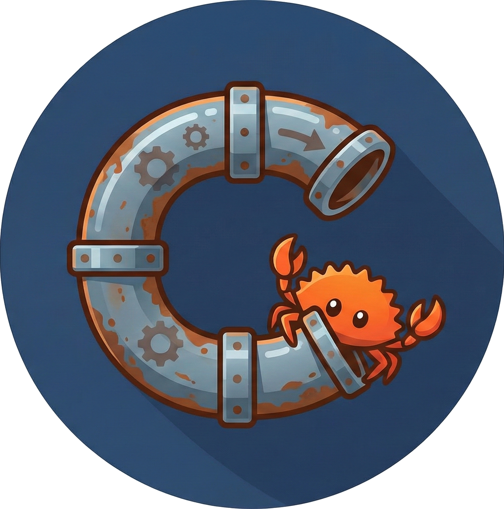
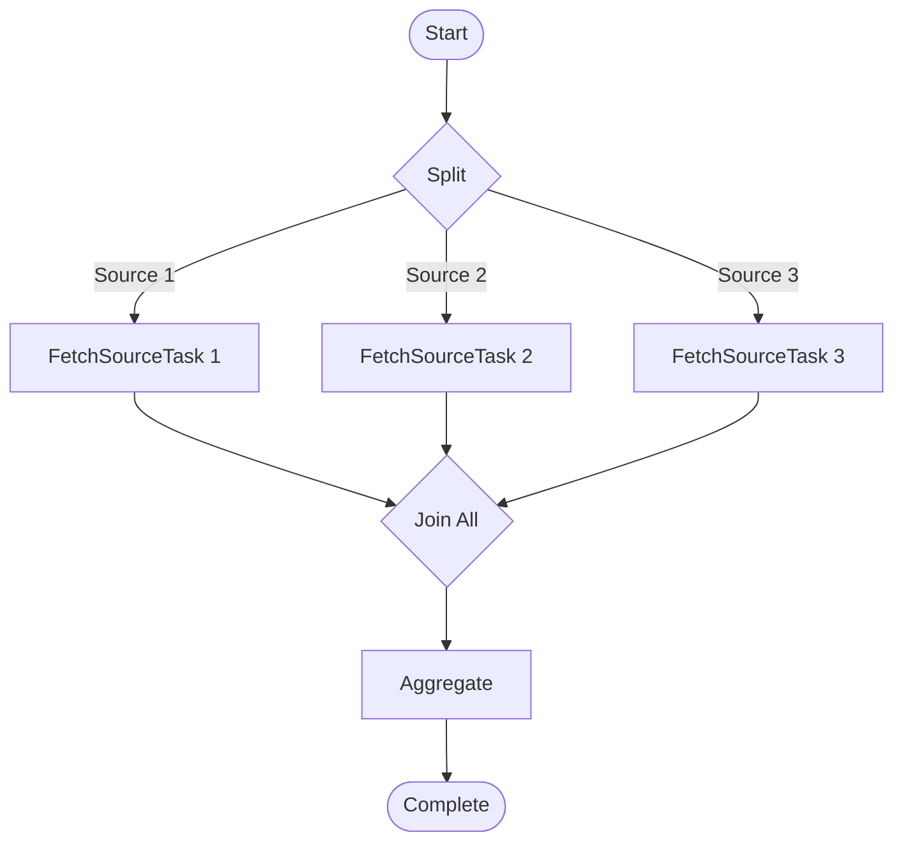

<div align="center">
  
  <h1>Cano: Type-Safe Async Workflow Engine</h1>

[](https://crates.io/crates/cano)
[](https://docs.rs/cano)
[](https://nassor.github.io/cano/)
[](https://crates.io/crates/cano)
[](https://github.com/nassor/cano/blob/main/LICENSE)
[](https://github.com/nassor/cano/actions)
[](https://www.rust-lang.org)

<em>**Orchestrate complex async processes with finite state machines, parallel execution, and built-in scheduling.**</em>
</div>

# Overview
Cano is a high-performance orchestration engine designed for building resilient, self-healing systems in Rust. Unlike simple task queues, Cano uses **Finite State Machines (FSM)** to define strict, type-safe transitions between processing steps.

It excels at managing complex lifecycles where state transitions matter:
*   **Data Pipelines**: ETL jobs with parallel processing (Split/Join) and aggregation.
*   **AI Agents**: Multi-step inference chains with shared context and memory.
*   **Background Systems**: Scheduled maintenance, periodic reporting, and distributed cron jobs.

The engine is built on three core concepts: **Tasks/Nodes** for logic, **Workflows** for state transitions, and **Schedulers** for timing.

## Features

- **Type-Safe State Machines**: Enum-driven transitions with compile-time guarantees.
- **Flexible Processing Units**: Choose between simple `Task`s or structured `Node`s (Prep/Exec/Post lifecycle).
- **Parallel Execution (Split/Join)**: Run tasks concurrently and join results with strategies like `All`, `Any`, `Quorum`, or `PartialResults`.
- **Robust Retry Logic**: Configurable strategies including exponential backoff with jitter.
- **Built-in Scheduling**: Cron-based, interval, and manual triggers for background jobs.
- **Observability**: Integrated `tracing` support for deep insights into workflow execution.
- **Performance-Focused**: Minimizes heap allocations by leveraging stack-based objects wherever possible, giving you control over where allocations occur.

## Simple Example: Parallel Processing

Here is a real-world example showing how to split execution into parallel tasks and join them back together.


```mermaid
graph TD
    Start([Start]) --> Split{Split}
    Split -->|Source 1| T1[FetchSourceTask 1]
    Split -->|Source 2| T2[FetchSourceTask 2]
    Split -->|Source 3| T3[FetchSourceTask 3]
    T1 --> Join{Join All}
    T2 --> Join
    T3 --> Join
    Join --> Aggregate[Aggregate]
    Aggregate --> Complete([Complete])
```

```rust
use cano::prelude::*;
use std::time::Duration;

#[derive(Debug, Clone, PartialEq, Eq, Hash)]
enum FlowState {
    Start,
    FetchData,
    Aggregate,
    Complete,
}

// A task that simulates fetching data from a source
#[derive(Clone)]
struct FetchSourceTask {
    source_id: u32,
}

#[async_trait::async_trait]
impl Task<FlowState, MemoryStore> for FetchSourceTask {
    async fn run(&self, _state: FlowState, store: &MemoryStore) -> Result<cano::TaskResult<FlowState>, CanoError> {
        // Simulate async work
        tokio::time::sleep(Duration::from_millis(100)).await;
        
        // Store result
        let key = format!("source_{}", self.source_id);
        store.set(key, format!("data_from_{}", self.source_id))?;
        
        Ok(cano::TaskResult::Single(FlowState::Aggregate))
    }
}

#[tokio::main]
async fn main() -> Result<(), CanoError> {
    let store = MemoryStore::new();
    let mut workflow: Workflow<FlowState, MemoryStore> = Workflow::new(store);

    // 1. Define parallel tasks
    let sources: Vec<std::sync::Arc<dyn Task<FlowState, MemoryStore>>> = vec![
        std::sync::Arc::new(FetchSourceTask { source_id: 1 }),
        std::sync::Arc::new(FetchSourceTask { source_id: 2 }),
        std::sync::Arc::new(FetchSourceTask { source_id: 3 }),
    ];

    // 2. Configure join strategy
    // Wait for ALL tasks to complete successfully before moving to Aggregate
    let join_config = JoinConfig::new(
        JoinStrategy::All,
        FlowState::Aggregate
    ).with_timeout(Duration::from_secs(5));

    // 3. Build Workflow
    workflow
        // Start -> Split into parallel tasks
        .register_split(
            FlowState::Start,
            sources,
            join_config
        )
        .add_exit_state(FlowState::Complete);

    // 4. Run
    let result = workflow.orchestrate(FlowState::Start).await?;
    println!("Workflow finished: {:?}", result);
    
    Ok(())
}
```

## Documentation

For complete documentation, examples, and guides, please visit our website:

👉 **[https://nassor.github.io/cano/](https://nassor.github.io/cano/)**

You can also find:
- **[API Documentation](https://docs.rs/cano)** on docs.rs
- **[Examples Directory](./examples/)** in the repository

## Contributing

Contributions are welcome! Please feel free to submit a Pull Request.

## License

This project is licensed under the MIT License - see the [LICENSE](LICENSE) file for details.
