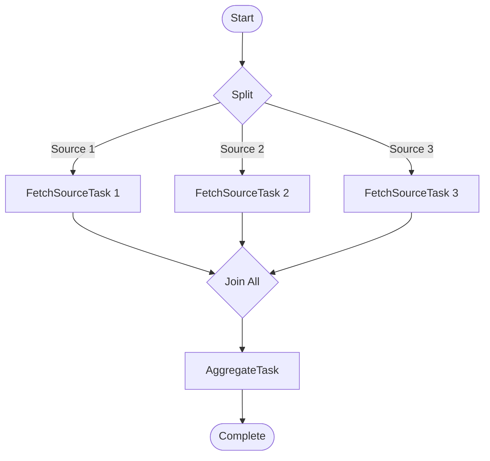

<div align="center">
  
  <h1>Cano: Type-Safe Async Workflow Engine</h1>

[](https://crates.io/crates/cano)
[](https://docs.rs/cano)
[](https://nassor.github.io/cano/)
[](https://crates.io/crates/cano)
[](https://github.com/nassor/cano/blob/main/LICENSE)
[](https://github.com/nassor/cano/actions)
[](https://www.rust-lang.org)

<em>**Orchestrate complex async processes with finite state machines, parallel execution, and built-in scheduling.**</em>

<em>Cano is still far from a 1.0 release. The API is subject to changes and may include breaking changes.</em>

</div>

# Overview

Cano is a high-performance orchestration engine designed for building resilient, self-healing systems in Rust. Unlike simple task queues, Cano uses **Finite State Machines (FSM)** to define strict, type-safe transitions between processing steps.

It excels at managing complex lifecycles where state transitions matter:
*   **Data Pipelines**: ETL jobs with parallel processing (Split/Join) and aggregation.
*   **AI Agents**: Multi-step inference chains with shared context and memory.
*   **Background Systems**: Scheduled maintenance, periodic reporting, and distributed cron jobs.

The engine is built on three core concepts: **Tasks** for logic, **Workflows** for state transitions, and **Schedulers** for timing.

## Features

- **Type-Safe State Machines**: Enum-driven transitions with compile-time guarantees.
- **Multiple Processing Models**: `Task` for general-purpose work, plus `RouterTask`, `PollTask`, `BatchTask`, and `SteppedTask` for specialized shapes — mixed freely in one workflow.
- **Resource Dependency Injection**: Typed, lifecycle-managed `Resources` dictionary with `setup`/`teardown`/`health` hooks, looked up by key and type, plus `#[derive(FromResources)]` for ergonomic wiring.
- **Parallel Execution (Split/Join)**: Run tasks concurrently and join results with strategies like `All`, `Any`, `Quorum`, or `PartialResults`, with an optional bulkhead to cap concurrency.
- **Robust Retry Logic**: Configurable strategies including exponential backoff with jitter and per-attempt timeouts.
- **Circuit Breaker**: Shared `CircuitBreaker` short-circuits calls to failing dependencies before the retry loop, with configurable failure threshold, cool-down, and half-open probing.
- **Rate Limiting**: Token-bucket (`RateLimiter`) and fixed-window (`WindowedRateLimiter`) throttles that compose into a `MultiRateLimiter` enforcing several weighted tiers at once.
- **Built-in Scheduling**: Cron-based, interval, and manual triggers for background jobs.
- **Crash Recovery**: Pluggable `CheckpointStore` records every FSM state entry; `Workflow::resume_from` rehydrates a crashed run and continues. Ships with an embedded, ACID `RedbCheckpointStore` behind the `recovery` feature.
- **Sagas / Compensation**: Pair a forward step with a `compensate` action via `CompensatableTask` + `register_with_compensation`; if a later step fails, the engine rolls back the work already done in reverse order (and replays the rollback across a crash when checkpointing is on).
- **Observability**: Optional `tracing` (spans + events, plus `TracingObserver`) and `metrics` (a `MetricsObserver` plus low-cardinality counters / histograms / gauges via the [`metrics`](https://docs.rs/metrics) facade) features for deep insight into workflow, task, retry, split/join, circuit-breaker, scheduler, processing-loop, recovery and saga internals; plus synchronous `WorkflowObserver` hooks for lifecycle/failure events and `Resource::health()` probes (`Resources::check_all_health`).
- **Performance-Focused**: Minimizes heap allocations by leveraging stack-based objects wherever possible, giving you control over where allocations occur.

For how the *resilient, self-healing* tagline maps to concrete primitives — retries, timeouts, circuit breakers, rate limiters, bulkheads, panic safety, checkpoint+resume, sagas, observers, health probes — see the [Resilience](https://nassor.github.io/cano/resilience/), [Recovery](https://nassor.github.io/cano/recovery/) and [Saga](https://nassor.github.io/cano/saga/) guides.

## Simple Example: Parallel Processing

Here is a real-world example showing how to split execution into parallel tasks and join them back together.


```mermaid
graph TD
    Start([Start]) --> Split{Split}
    Split -->|Source 1| T1[FetchSourceTask 1]
    Split -->|Source 2| T2[FetchSourceTask 2]
    Split -->|Source 3| T3[FetchSourceTask 3]
    T1 --> Join{Join All}
    T2 --> Join
    T3 --> Join
    Join --> Aggregate[AggregateTask]
    Aggregate --> Complete([Complete])
```

```rust
use cano::prelude::*;
use std::time::Duration;

#[derive(Debug, Clone, PartialEq, Eq, Hash)]
enum FlowState {
    Start,
    Aggregate,
    Complete,
}

// A task that simulates fetching a numeric value from a source.
#[derive(Clone)]
struct FetchSourceTask {
    source_id: u32,
}

#[task(state = FlowState)]
impl FetchSourceTask {
    async fn run(&self, res: &Resources) -> Result<TaskResult<FlowState>, CanoError> {
        // Look up the shared store from the workflow's resources.
        let store = res.get::<MemoryStore, _>("store")?;

        // Simulate async work.
        tokio::time::sleep(Duration::from_millis(100)).await;

        // Each source contributes a value; downstream aggregation will sum them.
        let value: u64 = (self.source_id as u64) * 10;
        let key = format!("source_{}", self.source_id);
        store.put(&key, value)?;

        Ok(TaskResult::Single(FlowState::Aggregate))
    }
}

// Runs after the split: reads each per-source value back out and sums them.
struct AggregateTask {
    source_ids: Vec<u32>,
}

#[task(state = FlowState)]
impl AggregateTask {
    async fn run(&self, res: &Resources) -> Result<TaskResult<FlowState>, CanoError> {
        let store = res.get::<MemoryStore, _>("store")?;

        let mut total: u64 = 0;
        for id in &self.source_ids {
            let value: u64 = store.get(&format!("source_{}", id))?;
            total += value;
        }
        store.put("total", total)?;
        println!("Aggregated total: {total}");

        Ok(TaskResult::Single(FlowState::Complete))
    }
}

#[tokio::main]
async fn main() -> Result<(), CanoError> {
    // 1. Register shared resources (the store is one resource among many).
    let resources = Resources::new().insert("store", MemoryStore::new());

    // 2. Define parallel tasks.
    let source_ids = vec![1, 2, 3];
    let sources: Vec<FetchSourceTask> = source_ids
        .iter()
        .map(|&source_id| FetchSourceTask { source_id })
        .collect();

    // 3. Configure the join strategy.
    // Wait for ALL fetches to succeed, then transition to Aggregate.
    let join_config = JoinConfig::new(JoinStrategy::All, FlowState::Aggregate)
        .with_timeout(Duration::from_secs(5));

    // 4. Build the workflow: Start -> Split fetches -> Aggregate -> Complete.
    let workflow = Workflow::new(resources)
        .register_split(FlowState::Start, sources, join_config)
        .register(FlowState::Aggregate, AggregateTask { source_ids })
        .add_exit_state(FlowState::Complete);

    // 5. Run.
    let result = workflow.orchestrate(FlowState::Start).await?;
    println!("Workflow finished: {:?}", result);

    Ok(())
}
```

## Documentation

For complete documentation, examples, and guides, please visit our website:

👉 **[https://nassor.github.io/cano/](https://nassor.github.io/cano/)**

You can also find:
- **[API Documentation](https://docs.rs/cano)** on docs.rs
- **[Examples Directory](./examples/)** in the repository

## Contributing

Contributions are welcome! Please feel free to submit a Pull Request.

## AI Disclosure

The primary developer of this repository uses AI coding assistants while
working on Cano. At the time of writing, the assistants in regular use are:

- **Claude Code** (Anthropic API), and
- **Qwen** and **DeepSeek** models running locally.

All AI-assisted output is reviewed, edited, tested, and submitted by a human
developer who is fully responsible for the resulting code. AI tools are
treated as accelerators, not authors. See
[AI_USAGE_POLICY.md](AI_USAGE_POLICY.md) for the full policy that contributors
are expected to follow when using AI assistants on this project.

## License

Licensed under either of

- Apache License, Version 2.0 ([LICENSE-APACHE](LICENSE-APACHE) or <http://www.apache.org/licenses/LICENSE-2.0>)
- MIT license ([LICENSE-MIT](LICENSE-MIT) or <http://opensource.org/licenses/MIT>)

at your option.

### Contribution

Unless you explicitly state otherwise, any contribution intentionally submitted for inclusion in the work by you, as defined in the Apache-2.0 license, shall be dual licensed as above, without any additional terms or conditions.
